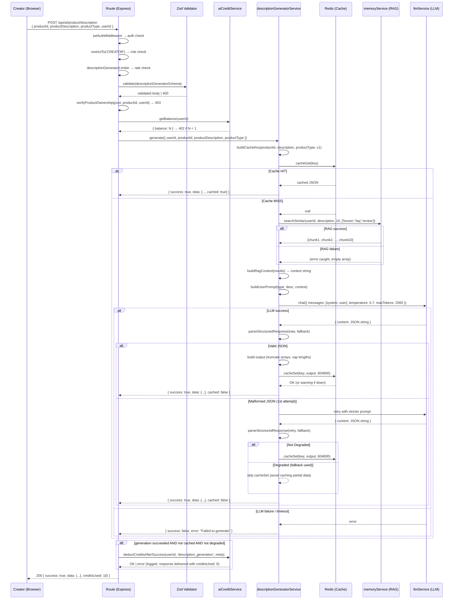

# Design: Description Generator

**Change**: description-generator
**Date**: 2026-06-12
**Status**: 🚧 IN DESIGN
**Author**: sdd-design
**PRD Ref**: PRD.md §4.11

---

## 1. Architecture Overview

The Description Generator adds a new AI capability that generates optimized product descriptions using LLM + RAG context. It follows the established singleton-service pattern from SEO Optimizer (line 258-376: exported `seoOptimizerService` object with a single `generate()` method) and the orchestrator registration pattern from `services/ai/index.ts` (24 capabilities already registered).

### High-level Architecture

```
┌──────────────────────────────────────────────────────────────────┐
│  POST /api/ai/product/description                                │
│                                                                  │
│  jwtAuthMiddleware → restrictTo('CREATOR')                       │
│                       → descriptionGeneratorLimiter(10/min)      │
│                       → validate(descriptionGeneratorSchema)     │
│                       → asyncHandler(route handler)              │
└───────────────────────────┬──────────────────────────────────────┘
                            │
     ┌───────────────────────┼───────────────────────┐
     ▼                       ▼                       ▼
┌──────────────┐ ┌──────────────────────┐ ┌──────────────────────┐
│verifyProduct │ │descriptionGenerator  │ │  aiCreditService     │
│Ownership()   │ │   Service            │ │  getBalance()        │
│(routeHelpers)│ │                      │ │  useCredits()        │
│              │ │  ┌────────────────┐  │ │  getOperationCost()  │
│throws 403    │ │  │ lib/ai-product-│  │ └──────────────────────┘
│(combined     │ │  │ optimizer.lib  │  │
│not-found/    │ │  │                │  │
│mismatch)     │ │  │                │  │
└──────────────┘ │  │                │  │
                 │  │ cache helpers  │──┼────► Redis
                 │  │ RAG fetch      │──┼────► memoryService
                 │  │ LLM wrapper    │──┼────► llmService
                 │  │ credit deduct  │──┼────► aiCreditService
                 │  │ parse response │  │
                 │  └────────────────┘  │
                 └──────────────────────┘
```

### Architecture Decisions

| # | Decision | Option A | Option B | Choice | Rationale |
|---|----------|----------|----------|--------|-----------|
| D1 | Cache client | New Redis instance (like skills-registry) | Reuse BullMQ's redisConnection | **A: New Redis (ioredis)** | Same pattern as `config.service.ts` and `skills-registry.service.ts` — lazy-init with `getRedisCache()`. BullMQ's connection is tuned for queues (maxRetriesPerRequest: null), not KV operations |
| D2 | Lib placement | Inline helpers in service | Separate `lib/ai-product-optimizer.lib.ts` | **B: Separate lib** | Proposal §4 requires shared lib for future SEO Optimizer refactor. Extracts RAG, LLM, parse, credits as pure functions |
| D3 | Credit deduction timing | Before LLM call (reserve) | After LLM success (deduct) | **B: After success** | Spec §Credit Operation requires deduction ONLY AFTER successful LLM response. Pre-check balance before call |
| D4 | Language detection | LLM-side in system prompt | Separate NLP library (franc/langdetect) | **A: LLM-side** | Simpler (no extra dependency), LLM already has multilingual capability. System prompt instructs: "detect input language, respond in same language" |
| D5 | Route handler | Inline handler in `ai.routes.ts` | Separate controller file | **A: Inline handler** | Matches SEO Optimizer pattern (lines 2407-2477). 24+ existing endpoints use inline handlers. No controller for single endpoint |
| D6 | Cache key hash | `crypto.createHash('sha256')` | `JSON.stringify` with sanitization | **A: SHA-256** | Deterministic, shorter keys, no escaping issues. Node.js built-in, no deps needed |
| D7 | Token budget (LLM max_tokens) | 500 tokens | 2000 tokens | **B: 2000 tokens** | Spec §Config keys defines `description_generator.max_tokens` default 2000. Output shape (titles[] + description + objectives[] + tags[] + metaDescription) needs more tokens than SEO Optimizer's 500 |

---

## 2. Module Structure

### 2.1 `backend/src/lib/ai-product-optimizer.lib.ts` (CREATE — ~150 lines)

> **Note**: The `backend/src/lib/` directory already houses shared helpers (e.g. `sanitizeEmailHtml.ts`, `withReadOnlyRole.ts`, `withSanitizedErrors.ts`). This change adds AI-specific optimization helpers to the existing convention. Future AI-related shared helpers (e.g. SEO Optimizer refactor) should also live here.

Reusable helpers extracted as pure/async functions. Purpose: avoid duplicating RAG, LLM, parse, and credit logic when SEO Optimizer is refactored later.

```typescript
// ai-product-optimizer.lib.ts — Shared helpers for product optimization services

import crypto from 'crypto';
import Redis from 'ioredis';
import { memoryService } from '../services/ai/memory.service';
import { llmService, type LLMMessage } from '../services/ai/llm.service';
import { aiCreditService } from '../services/ai/credits.service';
import { configService } from '../services/config.service';
import { config } from '../config';
import logger from '../utils/logger';
import type { EmbeddingSearchResult } from '../types/ai.types';
import type { z } from 'zod';

// ==========================================================================
// Cache constants
// ==========================================================================
const CACHE_PREFIX = 'description-generator:';
const CACHE_TTL = 604_800; // 7 days in seconds

export { CACHE_PREFIX, CACHE_TTL };

// ==========================================================================
// Lazy Redis client (same pattern as config.service.ts getRedisCache)
// ==========================================================================
let redisClient: Redis | null = null;

function getCacheRedis(): Redis {
  if (!redisClient) {
    redisClient = new Redis({
      host: config.redis?.host ?? 'localhost',
      port: config.redis?.port ?? 6379,
      password: config.redis?.password || undefined,
      keyPrefix: 'crema:',
      lazyConnect: true,
      retryStrategy: (times: number) => {
        if (times > 3) return null;
        return Math.min(times * 100, 3000);
      },
    });
  }
  return redisClient;
}

// ==========================================================================
// Description normalization for cache key (exports for testing)
// ==========================================================================
export function normalizeDescription(description: string): string {
  return description
    .trim()
    .toLowerCase()
    .replace(/<[^>]*>/g, '')     // Strip HTML tags
    .replace(/\s+/g, ' ')         // Collapse whitespace
    .slice(0, 5000);              // Cap length (matches zod max)
}

// ==========================================================================
// Cache key generation
// ==========================================================================
export function buildCacheKey(
  productId: string,
  description: string,
  productType: string,
  schemaVersion: number
): string {
  const normalized = normalizeDescription(description);
  const raw = `${productId}|${normalized}|${productType}|v${schemaVersion}`;
  const hash = crypto.createHash('sha256').update(raw).digest('hex');
  return `${CACHE_PREFIX}${hash}`;
}

// ==========================================================================
// Cache helpers (wrap Redis with graceful degradation)
// ==========================================================================
export async function cacheGet<T>(key: string): Promise<T | null> {
  try {
    const redis = getCacheRedis();
    const raw = await redis.get(key);
    if (!raw) return null;
    return JSON.parse(raw) as T;
  } catch (err) {
    logger.warn({ err, key }, 'cacheGet: Redis error, degrading to no-cache');
    return null;
  }
}

export async function cacheSet(key: string, value: unknown, ttl: number): Promise<void> {
  try {
    const redis = getCacheRedis();
    await redis.set(key, JSON.stringify(value), 'EX', ttl);
  } catch (err) {
    logger.warn({ err, key }, 'cacheSet: Redis error, skipping cache write');
    // Graceful degradation — generating service still succeeds
  }
}

// ==========================================================================
// RAG context fetch — query constructed from product description, no productId needed
// ==========================================================================
export async function fetchProductRagContext(
  userId: string,
  query: string
): Promise<EmbeddingSearchResult[]> {
  return memoryService.searchSimilar(userId, query, 10, ['lesson', 'faq', 'review']);
}

// ==========================================================================
// LLM call wrapper with config reading
// ==========================================================================
export async function callLLMForOptimization(
  systemPrompt: string,
  userPrompt: string,
  configPrefix: string,
  schema?: z.ZodType<unknown>  // Optional Zod schema for response validation (future enhancement)
): Promise<string> {
  const temperature = await configService.getNumber(`${configPrefix}.temperature`, 0.7);
  const maxTokens = await configService.getNumber(`${configPrefix}.max_tokens`, 2000);
  const model = await configService.get(`${configPrefix}.model`);

  const messages: LLMMessage[] = [
    { role: 'system', content: systemPrompt },
    { role: 'user', content: userPrompt },
  ];

  const response = await llmService.chat({
    messages,
    model: model || undefined,
    temperature,
    maxTokens,
  });

  return response.content;
}

// ==========================================================================
// Structured response parser (never throws)
// ==========================================================================
export function parseStructuredResponse<T>(rawText: string, fallback: T): T {
  let jsonStr = rawText.trim();

  // Strip markdown code fences
  const fenceMatch = jsonStr.match(/```(?:json)?\s*([\s\S]*?)```/);
  if (fenceMatch) {
    jsonStr = fenceMatch[1].trim();
  }

  try {
    return JSON.parse(jsonStr) as T;
  } catch {
    logger.warn({ rawText: jsonStr.slice(0, 200) }, 'parseStructuredResponse: malformed JSON');
    return fallback;
  }
}

// ==========================================================================
// Credit deduction after success
// NOTE: The operationKey union type is hardcoded here and in credits.service.ts.
// Future AI operations should extract this union to a single source of truth
// (e.g. a type alias in credits.service.ts) to avoid divergence.
// ==========================================================================
export async function deductCreditsAfterSuccess(
  userId: string,
  operationKey: 'search' | 'chat' | 'generate_insight' | 'churn_prediction' | 'description_generation',
  metadata: string
): Promise<void> {
  const cost = aiCreditService.getOperationCost(operationKey);
  await aiCreditService.useCredits(userId, cost, metadata);
}
```

**Responsibilities:**
- `normalizeDescription()` — trim, lowercase, strip HTML, collapse whitespace, cap 5000 chars
- `buildCacheKey()` — SHA-256 of `productId|norm|productType|v{ver}`
- `cacheGet<T>()` — Redis GET with graceful degradation (returns null on Redis down)
- `cacheSet()` — Redis SETEX with 7-day TTL, logs warning on Redis down
- `fetchProductRagContext()` — `memoryService.searchSimilar(userId, query, 10, ['lesson', 'faq', 'review'])`
- `callLLMForOptimization()` — config read + `llmService.chat()` with prefix-based config keys; optional `schema` param for future Zod response validation
- `parseStructuredResponse<T>()` — JSON parse with markdown fence stripping, returns fallback on error
- `deductCreditsAfterSuccess()` — typed `operationKey` union (no cast), delegates to `aiCreditService.useCredits()`

### 2.2 `backend/src/services/ai/description-generator.service.ts` (CREATE — ~350 lines)

Singleton service following SEO Optimizer pattern (lines 258-376 in `seo-optimizer.service.ts`).

```typescript
// description-generator.service.ts

import {
  fetchProductRagContext,
  callLLMForOptimization,
  parseStructuredResponse,
  buildCacheKey,
  cacheGet,
  cacheSet,
  CACHE_TTL,
  deductCreditsAfterSuccess,
} from '../../lib/ai-product-optimizer.lib';
import type { EmbeddingSearchResult } from '../../types/ai.types';
import logger from '../../utils/logger';
import { AppError } from '../../errors/AppError';

// ==========================================================================
// Types
// ==========================================================================
export type DescriptionProductType =
  | 'course'
  | 'ebook'
  | 'podcast'
  | 'membership'
  | 'software'
  | 'audiobook';

export interface DescriptionGeneratorInput {
  userId: string;
  productId: string;
  productDescription: string;
  productType: DescriptionProductType;
}

export interface DescriptionGeneratorOutput {
  titles: string[];
  description: string;
  objectives: string[];
  tags: string[];
  metaDescription: string;
  detectedLanguage: 'es' | 'en' | 'pt';
  sources: Array<{
    contentType: 'lesson' | 'faq' | 'review';
    contentId: string;
    similarity: number;
  }>;
  cached: boolean;
  degraded: boolean;  // true when LLM response was malformed, had empty required fields, or fallback was used
}

export interface DescriptionGeneratorResponse {
  success: boolean;
  data?: DescriptionGeneratorOutput;
  error?: string;
}

// ==========================================================================
// Schema version (bump when output shape changes)
// ==========================================================================
const SCHEMA_VERSION = 1;

// ==========================================================================
// Config keys prefix
// ==========================================================================
const CONFIG_PREFIX = 'description_generator';

// ==========================================================================
// LLM Prompt Templates
// ==========================================================================
const SYSTEM_PROMPT = `You are an expert in digital marketing and content optimization for educational digital products.

Your task: analyze the product description provided and generate optimized content for conversion and SEO.

LANGUAGE INSTRUCTION (CRITICAL):
1. FIRST, detect the language of the product description (Spanish, English, or Portuguese).
2. THEN, generate ALL output content IN THE SAME LANGUAGE detected.
3. Never respond in a different language than the input.

OUTPUT FORMAT (strict JSON, no additional text):
{
  "titles": ["title 1", "title 2", "title 3"],
  "description": "full conversion-optimized description, one paragraph",
  "objectives": ["objective 1", "objective 2", "objective 3", "objective 4", "objective 5"],
  "tags": ["tag1", "tag2", "tag3", "tag4", "tag5", "tag6", "tag7", "tag8", "tag9", "tag10"],
  "metaDescription": "one-line meta description for SEO (max 155 characters)",
  "detectedLanguage": "en"
}

RULES:
- titles: exactly 3 attractive and distinct alternatives
- description: one persuasive paragraph describing the value and benefits
- objectives: 3 to 5 concrete and measurable learning objectives
- tags: 5 to 10 relevant SEO keywords, in the detected language
- metaDescription: one attractive line of max 155 characters for search engines
- detectedLanguage: "es", "en", or "pt" per detected language

IMPORTANT: Respond ONLY with valid JSON. No markdown, no additional text.`;

const USER_PROMPT_TEMPLATE = `Generate optimized content for the following product:

**Product type**: {productType}
**Product description**:
{productDescription}

{ragContext}

Generate the JSON with the optimized content.`;

// ==========================================================================
// Private helpers
// ==========================================================================
function buildUserPrompt(
  productType: string,
  productDescription: string,
  ragContext: string
): string {
  return USER_PROMPT_TEMPLATE
    .replace('{productType}', productType)
    .replace('{productDescription}', productDescription)
    .replace('{ragContext}', ragContext || '');
}

function buildRagContext(ragResults: EmbeddingSearchResult[]): string {
  if (ragResults.length === 0) return '';
  const chunks = ragResults.map(
    (r, i) => `[Context ${i + 1}] (${r.source_type}): ${r.content}`
  );
  return '\n**Additional product context** (lessons, FAQs, reviews):\n\n' + chunks.join('\n\n');
}

function mapSources(ragResults: EmbeddingSearchResult[]) {
  return ragResults.map(r => ({
    contentType: r.source_type as 'lesson' | 'faq' | 'review',
    contentId: r.source_id,
    similarity: r.similarity,
  }));
}

/**
 * Post-parse validation: even if JSON parsed successfully, check required fields.
 * Returns true if the parsed output is degraded (empty/missing required fields).
 */
function hasDegradedFields(parsed: DescriptionGeneratorOutput): boolean {
  return !parsed.titles || parsed.titles.length === 0 || !parsed.objectives;
}

// ==========================================================================
// Service
// ==========================================================================
export const descriptionGeneratorService = {
  async generate(
    input: DescriptionGeneratorInput
  ): Promise<DescriptionGeneratorResponse> {
    // 1. Validate input (throws before cache/LLM)
    // Defense-in-depth: The HTTP path validates via Zod middleware first; the orchestrator
    // path doesn't use Zod, so service-level validation is the only check there.
    if (!input.productId || input.productId.trim().length === 0) {
      throw new AppError('productId is required', 400);
    }
    if (!input.productDescription || input.productDescription.trim().length < 10) {
      throw new AppError('productDescription must be at least 10 characters', 400);
    }
    if (input.productDescription.trim().length > 5000) {
      throw new AppError('productDescription must be at most 5000 characters', 400);
    }

    try {
      // 2. Check cache
      const cacheKey = buildCacheKey(
        input.productId,
        input.productDescription,
        input.productType,
        SCHEMA_VERSION
      );
      const cached = await cacheGet<DescriptionGeneratorOutput>(cacheKey);
      if (cached) {
        logger.info({ productId: input.productId, cacheKey }, 'Description generator: cache hit');
        return {
          success: true,
          data: { ...cached, cached: true },
        };
      }

      // 3. RAG context
      let ragResults: EmbeddingSearchResult[] = [];
      try {
        ragResults = await fetchProductRagContext(
          input.userId,
          input.productDescription
        );
      } catch (ragErr) {
        // RAG failure is non-blocking — degrade gracefully
        logger.warn({ err: ragErr, productId: input.productId }, 'RAG failed, continuing without context');
      }

      // 4. Build prompts
      const ragContext = buildRagContext(ragResults);
      const userPrompt = buildUserPrompt(input.productType, input.productDescription, ragContext);

      // 5. Call LLM
      let rawResponse: string;
      try {
        rawResponse = await callLLMForOptimization(SYSTEM_PROMPT, userPrompt, CONFIG_PREFIX);
      } catch (llmErr) {
        logger.error({ err: llmErr, productId: input.productId }, 'LLM call failed');
        throw new AppError('Failed to generate description', 500);
      }

      // 6. Parse response (first attempt)
      const fallback: DescriptionGeneratorOutput = {
        titles: [],
        description: input.productDescription,
        objectives: [],
        tags: [],
        metaDescription: input.productDescription.slice(0, 155),
        detectedLanguage: 'en',  // International default
        sources: mapSources(ragResults),
        cached: false,
        degraded: true, // NOTE: This `degraded: true` sentinel is ONLY set on this fallback object.
        // It is the sole mechanism for detecting parse failure. If the LLM prompt is ever changed
        // to include a `degraded` field in its JSON schema, this invariant would break.
        // The post-parse validation below also sets isDegraded for empty/missing required fields.
      };

      let isDegraded = false;
      let parsed = parseStructuredResponse<DescriptionGeneratorOutput>(rawResponse, fallback);

      // Post-parse validation: check required fields even if JSON parsed successfully
      if (!parsed.degraded && hasDegradedFields(parsed)) {
        isDegraded = true;
      }

      // 7. If parsing returned fallback (malformed JSON) or post-parse validation failed, retry once with stricter prompt
      if (parsed.degraded === true || isDegraded) {
        logger.warn({ productId: input.productId }, 'First parse failed, retrying with stricter prompt');
        const strictPrompt = SYSTEM_PROMPT + '\n\nATTENTION: The previous JSON was invalid. Respond EXCLUSIVELY with JSON. No markdown.';
        const retryResponse = await callLLMForOptimization(strictPrompt, userPrompt, CONFIG_PREFIX);
        parsed = parseStructuredResponse<DescriptionGeneratorOutput>(retryResponse, fallback);

        // Re-apply post-parse validation on retry result
        if (parsed.degraded === true || hasDegradedFields(parsed)) {
          logger.warn({ productId: input.productId }, 'Both LLM attempts returned malformed or incomplete data');
          isDegraded = true;
          // Return fallback with degraded:true — caller handles
        } else {
          isDegraded = false; // Retry succeeded — clear degraded flag
        }
      }

      // 8. Build final output
      const output: DescriptionGeneratorOutput = {
        titles: parsed.titles?.slice(0, 3) || [],
        description: parsed.description || input.productDescription,
        objectives: parsed.objectives?.slice(0, 5) || [],
        tags: parsed.tags?.slice(0, 10) || [],
        metaDescription: (parsed.metaDescription || '').slice(0, 155),
        detectedLanguage: ['es', 'en', 'pt'].includes(parsed.detectedLanguage)
          ? parsed.detectedLanguage
          : 'en',  // International default
        sources: mapSources(ragResults),
        cached: false,
        degraded: isDegraded,
      };

      // 9. Store in cache (skip degraded output — don't cache fallback data)
      if (!isDegraded) {
        await cacheSet(cacheKey, output, CACHE_TTL);
      }

      logger.info({ productId: input.productId }, 'Description generated successfully');
      return { success: true, data: output };
    } catch (error) {
      if (error instanceof AppError) {
        return { success: false, error: error.message };
      }
      logger.error({ error, productId: input.productId }, 'Description generation unexpected error');
      return { success: false, error: 'Failed to generate product description' };
    }
  },
};
```

**Key design decisions in the service:**
- RAG is non-blocking — if `memoryService.searchSimilar` fails, the service degrades gracefully and generates without context
- Parse retry: if first LLM response is malformed JSON, retry once with stricter prompt
- Output is always safe — array fields are truncated to spec limits, metaDescription capped at 155 chars
- Cache key is computed BEFORE LLM call (cheap operation) to check for cached results

### 2.3 `backend/src/schemas/ai.schema.ts` (MODIFY — +20 lines)

Add Zod schema after `seoOptimizerSchema` (line 195):

```typescript
// Description Generator
export const descriptionGeneratorSchema = z.object({
  productId: z.string().uuid({ message: 'productId must be a valid UUID' }),
  productDescription: z
    .string()
    .min(10, { message: 'productDescription must be at least 10 characters' })
    .max(5000, { message: 'productDescription must be at most 5000 characters' }),
  productType: z.enum(['course', 'ebook', 'podcast', 'membership', 'software', 'audiobook'], {
    message: 'productType must be one of: course, ebook, podcast, membership, software, audiobook',
  }),
  userId: z.string().uuid({ message: 'userId must be a valid UUID' }),
});

export type DescriptionGeneratorRequest = z.infer<typeof descriptionGeneratorSchema>;
```

### 2.4 `backend/src/routes/ai.routes.ts` (MODIFY — +30 lines)

Add route after SEO Optimizer block (line 2477), before `export default router`:

```typescript
// ============================================
// Description Generator Routes
// ============================================

/**
 * POST /api/ai/product/description
 * Generate title, description, tags, and learning objectives for a product
 * Access: JWT (creator only, must own the product)
 * Rate limited: 10/min (descriptionGeneratorLimiter)
 * Credits: 1 credit per generation (deducted AFTER LLM success, 0 on cache hit)
 */
router.post(
  '/product/description',
  jwtAuthMiddleware,
  restrictTo('CREATOR'), // Defense-in-depth: SEO Optimizer doesn't use this middleware (relies on
  // inline creator_id check), but description-generator adds explicit role enforcement because
  // verifyProductOwnership only matches creator_id in its SQL — non-CREATOR roles should be
  // rejected before reaching the DB query.
  descriptionGeneratorLimiter,
  validate(descriptionGeneratorSchema),
  asyncHandler(async (req: Request, res: Response) => {
    const userId = uid(req);
    const { productId, productDescription, productType } = req.body as DescriptionGeneratorRequest;

    // 1. Verify product ownership (uses existing helper — throws AppError(403) for both not-found and mismatch)
    // Note: verifyProductOwnership uses a single combined query (WHERE id = $1 AND creator_id = $2),
    // so it returns 403 for both "product doesn't exist" and "user doesn't own it". This differs from
    // the SEO Optimizer route which uses inline pool.query with separate 404/403 checks.
    await verifyProductOwnership(pool, productId, userId);

    // 2. Pre-check credits (before expensive LLM call)
    const creditBalance = await aiCreditService.getBalance(userId);
    if (creditBalance.balance < 1) {
      throw new AppError('Insufficient credits', 402);
    }

    // 3. Call service with timeout protection (60s)
    const DESCRIPTION_LLM_TIMEOUT_MS = 60_000;
    let timeoutId: NodeJS.Timeout | undefined;
    const descPromise = descriptionGeneratorService.generate({
      userId,
      productId,
      productDescription,
      productType,
    });
    const timeoutPromise = new Promise<never>((_, reject) => {
      timeoutId = setTimeout(
        () => reject(new AppError('Description generation timed out', 504)),
        DESCRIPTION_LLM_TIMEOUT_MS
      );
    });
    try {
      const result = await Promise.race([descPromise, timeoutPromise]);

      if (!result.success) {
        throw new AppError(result.error || 'Description generation failed', 500);
      }

      // 4. Deduct credits ONLY if not cached, not degraded, and generation succeeded
      if (result.data && !result.data.cached && !result.data.degraded) {
        try {
          await deductCreditsAfterSuccess(
            userId,
            'description_generation',
            `Description Generator: ${productId}`
          );
        } catch (creditError: unknown) {
          if (creditError instanceof AppError) throw creditError;
          logger.error(
            {
              error: creditError instanceof Error ? creditError.message : 'Unknown',
              userId,
              productId,
            },
            'Credit deduction failed after LLM success — response delivered with creditsUsed: 0'
          );
          // Graceful degradation: LLM succeeded, don't penalize user for credit service failure
          // Same pattern as affiliate chat (ai.routes.ts lines 2295-2306)
        }
      }

      res.json({
        success: true,
        data: result.data,
        creditsUsed: (result.data?.cached || result.data?.degraded) ? 0 : 1,
      });
    } finally {
      if (timeoutId) clearTimeout(timeoutId);
    }
  })
);
```

**Imports to add** (in the imports section, ~lines 14-77):
```typescript
import { descriptionGeneratorLimiter } from '../middlewares/rateLimit/rateLimit';
import { descriptionGeneratorService } from '../services/ai/description-generator.service';
import { descriptionGeneratorSchema, type DescriptionGeneratorRequest } from '../schemas/ai.schema';
import { restrictTo } from '../middlewares/auth/role.middleware';
import { verifyProductOwnership } from '../utils/routeHelpers.util';
import { deductCreditsAfterSuccess } from '../lib/ai-product-optimizer.lib';
```

### 2.5 `backend/src/services/ai/index.ts` (MODIFY — +40 lines)

Add orchestrator capability registration after `seo-optimizer` block (line 430), following the exact same handler pattern:

```typescript
// Import
import { descriptionGeneratorService } from './description-generator.service';

// Skill registration (inside skills array)
  {
    id: 'description-generator',
    name: 'Description Generator',
    capability: 'description.generator',
    description: 'Genera título, descripción, tags y objetivos de aprendizaje para productos',
    parameters: [
      { name: 'requestingUserId', type: 'string', required: true },
      { name: 'productId', type: 'string', required: true },
      { name: 'productDescription', type: 'string', required: true },
      { name: 'productType', type: 'string', required: true },
      { name: 'userId', type: 'string', required: true },
      // Note: In the route, both `requestingUserId` and `userId` resolve to the JWT user.
      // The orchestrator uses `requestingUserId` for auth check and `userId` for the service
      // call — they're always equal in practice but represent different semantic concepts
      // (request context vs. resource owner context).
    ],
    options: { timeout: 30000, retries: 2, cacheable: false },
    handler: async (input: unknown) => {
      if (!input || typeof input !== 'object') {
        throw new AppError('Invalid input: must be an object', 400);
      }
      const { requestingUserId, productId, productDescription, productType, userId } =
        input as {
          requestingUserId: unknown;
          productId: unknown;
          productDescription: unknown;
          productType: unknown;
          userId: unknown;
        };

      // Validate required parameters
      if (typeof requestingUserId !== 'string' || requestingUserId.length === 0) {
        throw new AppError('requestingUserId is required', 400);
      }
      if (typeof productId !== 'string' || productId.length === 0) {
        throw new AppError('productId is required', 400);
      }
      if (typeof productDescription !== 'string' || productDescription.length < 10) {
        throw new AppError('productDescription must be at least 10 characters', 400);
      }
      if (typeof productType !== 'string') {
        throw new AppError('productType is required', 400);
      }
      // Defense-in-depth: orchestrator path bypasses Zod validation, so validate enum here
      const VALID_PRODUCT_TYPES = ['course', 'ebook', 'podcast', 'membership', 'software', 'audiobook'] as const;
      if (!VALID_PRODUCT_TYPES.includes(productType as typeof VALID_PRODUCT_TYPES[number])) {
        throw new AppError('productType must be one of: course, ebook, podcast, membership, software, audiobook', 400);
      }
      if (typeof userId !== 'string' || userId.length === 0) {
        throw new AppError('userId is required', 400);
      }

      // Authorization
      if (requestingUserId !== userId) {
        throw new AppError('Unauthorized access to description generator', 403);
      }

      // Note: Product ownership is NOT checked here — it is assumed to be pre-checked
      // by the caller (the route handler verifies ownership via verifyProductOwnership).
      // The orchestrator trusts that the caller has already validated resource access.

      return descriptionGeneratorService.generate({
        userId: requestingUserId,
        productId,
        productDescription,
        productType: productType as
          | 'course'
          | 'ebook'
          | 'podcast'
          | 'membership'
          | 'software'
          | 'audiobook',
      });
    },
  },
```

### 2.6 `backend/src/middlewares/rateLimit/rateLimit.ts` (MODIFY — +20 lines)

Add after `seoOptimizerLimiter` (line 343), following the identical pattern:

```typescript
// Rate limiter para Description Generator — 10 requests/min
// SPEC §4.11: dedicated limiter for description generation endpoint
export const descriptionGeneratorLimiter = rateLimit({
  windowMs: 60 * 1000, // 1 minuto
  limit: 10, // máximo 10 generaciones de descripción por minuto
  message: {
    success: false,
    error: 'Límite de generación de descripción alcanzado. Intenta de nuevo en 1 minuto.',
  },
  standardHeaders: true,
  legacyHeaders: false,
  keyGenerator: req => {
    const userId = req.user?.id;
    if (userId && typeof userId === 'string' && userId.length > 0) return userId;
    return ipKeyGenerator(req.ip || '');
  },
  handler: (req, res, _next, options) => {
    logger.warn(
      { key: req.rateLimit?.key, path: req.path },
      'Límite de generación de descripción alcanzado'
    );
    res.status(options.statusCode || 429).json(options.message);
  },
});
```

### 2.7 `backend/src/services/ai/credits.service.ts` (MODIFY — +5 lines)

Add `description_generation` operation cost to `getOperationCost()` method (line 244-252):

```typescript
getOperationCost(operation: 'search' | 'chat' | 'generate_insight' | 'churn_prediction' | 'description_generation'): number {
  const costs = {
    search: 1,
    chat: 5,
    generate_insight: 10,
    churn_prediction: 5,
    description_generation: 1,
  };
  return costs[operation];
}
```

---

## 3. LLM Prompt Engineering

### 3.1 System Prompt

The system prompt is in English with a **language detection instruction** as the first directive:

> LANGUAGE INSTRUCTION (CRITICAL):
> 1. FIRST, detect the language of the product description (Spanish, English, or Portuguese).
> 2. THEN, generate ALL output content IN THE SAME LANGUAGE detected.
> 3. Never respond in a different language than the input.

This avoids the need for `franc`/`langdetect` libraries. The LLM's multilingual capability handles detection and output. The prompt is in English because LLMs follow instructions more reliably in English, while the output language is determined by the detected input language.

### 3.2 User Prompt Template

Product metadata + optional RAG context:

```
Generate optimized content for the following product:

**Product type**: {productType}
**Product description**:
{productDescription}

**Additional product context** (lessons, FAQs, reviews):
[Context 1] (lesson): ...
[Context 2] (faq): ...
```

### 3.3 Output Format (JSON schema for LLM)

```json
{
  "titles": ["string (exactly 3)"],
  "description": "string (1 paragraph, conversion-optimized)",
  "objectives": ["string (3-5 learning objectives)"],
  "tags": ["string (5-10 SEO keywords)"],
  "metaDescription": "string (max 155 chars, 1 line)",
  "detectedLanguage": "es | en | pt"
}
```

### 3.4 Token Budget Estimation

| Component | Estimated tokens | Notes |
|-----------|-----------------|-------|
| System prompt | ~350 tokens | Fixed template |
| User prompt (description) | ~500-1500 tokens | Variable, max 5000 chars input |
| RAG context | ~200-1000 tokens | 10 chunks × ~50-100 tokens each |
| Output JSON | ~300-500 tokens | titles (3) + description + objectives (5) + tags (10) + metaDescription |
| **Total input** | ~1050-2850 tokens | |
| **Total output (max)** | 2000 tokens | Configurable via `description_generator.max_tokens` |

### 3.5 Product Type Examples

| Type | Description example | Expected output language focus |
|------|-------------------|-------------------------------|
| `course` | "Aprende TypeScript desde cero. 12 módulos, 50 ejercicios prácticos, proyecto final." | Learning objectives: "Dominar tipos avanzados", "Crear aplicaciones full-stack" |
| `ebook` | "Guía completa de marketing digital para emprendedores. 250 páginas con casos reales." | Tags: "marketing digital", "emprendimiento", "SEO", "redes sociales" |
| `podcast` | "Entrevistas semanales con líderes tech. 50 episodios con insights exclusivos." | Description: "Descubre los secretos de..." (conversational tone) |
| `membership` | "Acceso ilimitado a 200+ cursos, mentorías en vivo, comunidad privada." | Objectives: "Acceder a contenido premium", "Conectar con expertos" |
| `software` | "Herramienta de gestión de proyectos con IA integrada. Kanban, Gantt, reportes." | Tags: "gestión de proyectos", "software productividad", "IA" |
| `audiobook` | "Narración profesional de 'El Arte de la Guerra'. 4 horas de audio inmersivo." | Description: "Experimenta la sabiduría milenaria..." (immersive tone) |

---

## 4. RAG Strategy

### 4.1 Query Construction

The RAG query is the `productDescription` itself — the most information-rich input available:

```typescript
memoryService.searchSimilar(
  userId,
  productDescription,  // ← used as RAG query
  10,                  // top K
  ['lesson', 'faq', 'review']  // source type filter
)
```

This matches the SEO Optimizer pattern (line 274-279), which uses `${productName} ${productDescription}`. Description Generator uses just the description since product name is not a separate field.

### 4.2 Source Type Filter

Only content types relevant to product presentation:
- `lesson` — learning content that informs objectives
- `faq` — common questions that inform description tone
- `review` — social proof that informs conversion optimization

Excluded: `policy`, `qa`, `insight`, `saved_dashboard` (internal/customer-support content, not marketing-relevant).

### 4.3 Empty RAG Context Fallback

When `memoryService.searchSimilar` returns 0 results OR throws:
- The RAG context section is omitted from the prompt (`ragContext` = empty string)
- The LLM generates from `productDescription` alone
- Sources array in output is `[]`
- No error is thrown — degradation is silent (logged as info)

### 4.4 Context Format in LLM Prompt

```
**Additional product context** (lessons, FAQs, reviews):

[Context 1] (lesson): In this module you'll learn the fundamentals of TypeScript...
[Context 2] (faq): Do I need prior experience? No, we start from scratch...
[Context 3] (review): Excellent course, very well explained. 5/5 stars...
```

---

## 5. Cache Implementation

### 5.1 Key Formula

```
description-generator:{SHA-256(productId + "|" + description_normalized + "|" + productType + "|v" + schema_version)}
```

> **Cache invalidation on config change**: The cache key does NOT include `temperature`, `max_tokens`, or `model`. If any of these config values change, bump `SCHEMA_VERSION` to invalidate all cached entries in a one-time cache flush. This is intentional — config changes are rare and a full cache flush is acceptable.

### 5.2 Normalization Rules

`normalizeDescription()`:
1. `trim()` — remove leading/trailing whitespace
2. `toLowerCase()` — case insensitive
3. `/<[^>]*>/g` → `""` — strip HTML tags
4. `/\s+/g` → `" "` — collapse multiple whitespace to single space
5. `.slice(0, 5000)` — cap to max schema length

### 5.3 Redis Client

Lazy-init `ioredis` client, same pattern as `config.service.ts` `getRedisCache()` (line 72):
- `keyPrefix: 'crema:'` — namespace isolation
- `lazyConnect: true` — don't block startup if Redis is down
- `retryStrategy` — max 3 retries with exponential backoff

### 5.4 Cache Flow

```
generate(input)
  │
  ├── buildCacheKey(productId, description, productType, v1)
  │     └── normalizeDescription() → SHA-256 → key string
  │
  ├── cacheGet(key)
  │     ├── HIT → return cached output + cached:true (0 credits, 0 LLM)
  │     └── MISS → continue
  │
  ├── [LLM generation...]
  │
  ├── cacheSet(key, output, 604800)
  │     └── Redis SETEX (or log warning if Redis down)
  │
  └── return output + cached:false
```

### 5.5 TTL and Schema Version

| Property | Value |
|----------|-------|
| TTL | 604,800 seconds (7 days) |
| Schema version | `const SCHEMA_VERSION = 1` |
| Version bump trigger | Changes to `DescriptionGeneratorOutput` shape |
| Hash function | `crypto.createHash('sha256')` from Node.js `crypto` module |

---

## 6. Error Handling Strategy

| Error Scenario | HTTP Status | Handling | Location |
|---------------|-------------|----------|----------|
| Missing/invalid JWT | 401 | `jwtAuthMiddleware` rejects before route handler | Middleware chain |
| Non-creator role | 403 | `restrictTo('CREATOR')` middleware | Middleware chain |
| Zod validation failure | 400 | `validate(descriptionGeneratorSchema)` before handler | Middleware chain |
| Product not found / ownership mismatch | 403 | `verifyProductOwnership` throws 403 for both (single combined query — does not distinguish not-found from mismatch) | Route handler |
| Insufficient credits (pre-check) | 402 | `balance < 1` before LLM call | Route handler |
| LLM timeout (60s) | 504 | `Promise.race([service, timeout])` | Route handler |
| LLM provider error | 500 | Service catches → returns `{ success: false }` → route handler re-throws as `AppError(..., 500)` | Service — LLM call block |
| LLM malformed JSON (1st attempt) | — | Retry once with stricter prompt | Service — response parse block |
| LLM malformed JSON (2nd attempt) | — | Return fallback with `success: true` (partial data) | Service — response parse block |
| Cache Redis down | — | `cacheGet` returns `null`, `cacheSet` logs warning → service proceeds | Lib |
| RAG memory down | — | `try/catch` in service → `ragResults = []` → generates without context | Service — RAG fetch block |
| Credit service down (deduction) | — | Catches non-AppError in route handler → logs error, returns 200 with `creditsUsed: 0` (graceful degradation — same pattern as affiliate chat) | Route handler |
| Rate limit exceeded | 429 | `descriptionGeneratorLimiter` rejects before handler | Middleware chain |

### Retry strategy for LLM:
1. **First attempt**: system prompt + user prompt with RAG context
2. **Malformed JSON**: retry ONCE with stricter prompt (appends: "ATTENTION: The previous JSON was invalid. Respond EXCLUSIVELY with JSON. No markdown.")
3. **Timeouts**: no automatic retry — 504 returned immediately
4. **Provider rate limits (and other LLM errors)**: no automatic retry — 500 returned with error message (route handler maps service `{ success: false }` to `AppError(..., 500)`)

---

## 7. Testing Strategy

### 7.1 Unit Tests — Service (`description-generator.service.test.ts`, ~250 lines, split across PR 2a + PR 2b)

**Mock pattern**: Same as `seo-optimizer.service.test.ts` (lines 17-34):

```typescript
vi.mock('../../lib/ai-product-optimizer.lib', () => ({
  fetchProductRagContext: vi.fn(),
  callLLMForOptimization: vi.fn(),
  parseStructuredResponse: vi.fn(),
  buildCacheKey: vi.fn(),
  cacheGet: vi.fn(),
  cacheSet: vi.fn(),
  CACHE_TTL: 604800,
  deductCreditsAfterSuccess: vi.fn(),
}));
```

| Test group | Tests | What it validates |
|-----------|-------|-------------------|
| Input validation | 3 | productId empty → 400, description < 10 chars → 400, description > 5000 → 400 |
| Cache hit | 2 | Returns cached output + cached:true, 0 LLM calls |
| Cache miss | 1 | Cache miss triggers LLM call |
| RAG context | 2 | RAG results passed to prompt builder, empty RAG → prompt without context |
| RAG failure | 1 | RAG throws → degrades gracefully, output still generated |
| LLM success | 2 | Valid JSON parsed correctly, all output fields populated |
| LLM malformed JSON (1st attempt) | 1 | parseStructuredResponse returns fallback, retry triggered |
| LLM malformed JSON (2nd attempt) | 1 | Both attempts fail → fallback returned with success:true |
| Language detection | 3 | Spanish input → detectedLanguage: 'es', English → 'en', Portuguese → 'pt' |
| Cache key generation | 2 | Same input → same key, different description → different key |
| Output truncation | 3 | titles capped at 3, tags capped at 10, metaDescription capped at 155 chars |

**Coverage target**: ≥90% for service lines, ≥100% for exported helper functions.

### 7.2 Unit Tests — Lib (`ai-product-optimizer.lib.test.ts`, ~150 lines)

| Test group | Tests | What it validates |
|-----------|-------|-------------------|
| `normalizeDescription` | 5 | Trim, lowercase, strip HTML, collapse whitespace, cap 5000 |
| `buildCacheKey` | 3 | Deterministic, different inputs → different keys, schema version changes key |
| `cacheGet` | 2 | Valid JSON returns parsed, Redis error returns null |
| `cacheSet` | 1 | Redis error logs warning, does not throw |
| `parseStructuredResponse` | 3 | Valid JSON parsed, markdown fence stripped, malformed returns fallback |
| `fetchProductRagContext` | 1 | Calls memoryService.searchSimilar with correct params |
| `callLLMForOptimization` | 1 | Reads config, calls llmService.chat, returns content |
| `deductCreditsAfterSuccess` | 1 | Calls aiCreditService.useCredits with correct params |

### 7.3 Integration Tests — Route (`description-generator.routes.test.ts`, ~200 lines)

**Pattern**: Same as `seo-optimizer.routes.test.ts` (lines 1-441):

```typescript
// Mock the service
vi.mock('../../services/ai/description-generator.service', () => ({
  descriptionGeneratorService: {
    generate: vi.fn(),
  },
}));

// Mock rate limiter — passthrough with headers
const withHeaders = vi.fn((_req, res, next) => {
  res.setHeader('X-RateLimit-Limit', '10');
  res.setHeader('X-RateLimit-Remaining', '9');
  // ...
  next();
});

// Mock credits service
vi.mock('../../services/ai/credits.service', () => ({
  aiCreditService: {
    getBalance: vi.fn().mockResolvedValue({ balance: 10, expiresAt: new Date() }),
    useCredits: vi.fn().mockResolvedValue(undefined),
  },
}));
```

| Test group | Tests | HTTP assertions |
|-----------|-------|----------------|
| Authentication | 2 | No JWT → 401, invalid JWT → 401 |
| Validation | 4 | Missing productId → 400, invalid UUID → 400, description < 10 chars → 400, invalid productType → 400 |
| Authorization | 2 | Non-CREATOR role → 403, Product owned by different user / not found → 403 |
| Credits | 2 | 0 credits → 402, sufficient credits → success |
| Success (cache miss) | 1 | 200, { success: true, data: {...}, creditsUsed: 1 } |
| Success (cache hit) | 1 | 200, data.cached = true, creditsUsed: 0 |
| Rate limit headers | 1 | X-RateLimit-Limit, X-RateLimit-Remaining, X-RateLimit-Reset present |
| Service error | 1 | Service returns success:false → 500 |
| Timeout | 1 | Service hangs > 60s → 504 |
| Credit deduction failure | 1 | Credit service throws → 200, creditsUsed: 0 (graceful degradation) |

### 7.4 Mock Patterns Summary

All mocks follow the established `vi.mock` pattern with factory functions:
- **Service mocks**: `vi.mock('../../services/ai/description-generator.service', () => ({ ... }))`
- **Lib mocks**: `vi.mock('../../lib/ai-product-optimizer.lib', () => ({ ... }))`
- **Rate limiter mocks**: Passthrough functions with headers (lines 94-104 in SEO route test)
- **Config mocks**: `vi.mock('../../services/config.service', () => ({ configService: { getNumber: vi.fn().mockResolvedValue(0.7), get: vi.fn().mockResolvedValue(null) } }))`
- **Database mocks**: `vi.mocked(pool.query).mockResolvedValue({ rows: [...] })`

---

## 8. Sequence Diagram



---

## 9. Chained PR Breakdown

All 4 PRs are independently atomic and mergeable. Each PR includes its own tests (strict TDD compliance per `openspec/config.yaml`). Each targets `master` directly (not stacked).

### PR 1: `feat/description-generator-shared-lib` (~303 lines)
**Scope**: Create shared lib + lib unit tests.

| File | Action | Lines |
|------|--------|-------|
| `backend/src/lib/ai-product-optimizer.lib.ts` | Create | ~150 |
| `backend/src/lib/ai-product-optimizer.lib.test.ts` | Create | ~150 |
| `backend/src/services/config.service.ts` | Modify (+3 ALLOWED_CONFIG_KEYS entries) | ~3 |

**Dependency**: None — pure creation, no imports of this file exist yet.
**Merge order**: First (enables PRs 2-3).
**Verification**: `pnpm run vitest` — lib unit tests pass. `pnpm tsc --noEmit` — compiles.
**Test coverage**: `normalizeDescription` (5), `buildCacheKey` (3), `cacheGet` (2), `cacheSet` (1), `parseStructuredResponse` (3), `fetchProductRagContext` (1), `callLLMForOptimization` (1), `deductCreditsAfterSuccess` (1) = 17 tests.

### PR 2a: `feat/description-generator-service-skeleton` (~300 lines)
**Scope**: Service skeleton + input validation + cache READ logic. Establishes the service module and validates inputs (defense-in-depth, see W3).

| File | Action | Lines |
|------|--------|-------|
| `backend/src/services/ai/description-generator.service.ts` | Create (skeleton + validation + cache read) | ~250 |
| `backend/src/__tests__/services/ai/description-generator.service.test.ts` | Create (partial — 3 validation tests: empty productId, description < 10 chars, description > 5000 chars) | ~50 |

**Dependency**: Uses `lib/ai-product-optimizer.lib.ts` (PR 1 must be merged first).
**Merge order**: Second (after PR 1).
**Verification**: `pnpm tsc --noEmit` compiles. Service file exists with exported `descriptionGeneratorService` object and `generate()` method.
**Test scenarios in scope**: Input validation (3 tests — T2.1.0: empty productId, description < 10 chars, description > 5000 chars).
**Test file**: `backend/src/__tests__/services/ai/description-generator.service.test.ts` (partial, ~50 lines).

---

### PR 2b: `feat/description-generator-service-core` (~300 lines)
**Scope**: RAG + LLM call + parse with retry + output building (with `degraded` flag) + cache WRITE (with degraded guard) + error handling wrapper + language detection via system prompt.

| File | Action | Lines |
|------|--------|-------|
| `backend/src/services/ai/description-generator.service.ts` | MODIFY (extends skeleton from PR 2a) | +100 (~350 total) |
| `backend/src/__tests__/services/ai/description-generator.service.test.ts` | Extend (remaining ~200 lines; ~50 lines already created in PR 2a) | ~200 |

**Dependency**: Uses PR 1 (lib) + PR 2a (skeleton). Both must be merged first.
**Merge order**: Third (after PR 1 + PR 2a).
**Verification**: `pnpm run vitest` — all service tests pass. `pnpm tsc --noEmit` — compiles.
**Test scenarios in scope**: Cache hit (2), cache miss (1), RAG context (2), RAG failure (1), LLM success (2), LLM malformed JSON retry (2), language detection (3), output truncation (3), cache key generation (2), degraded output (1) = 21 tests (plus 3 validation tests from PR 2a = 24 total service tests).
**Verify gate**: T2.8b — must pass before PR 3 starts.

### PR 3: `feat/description-generator-registration` (~320 lines)
**Scope**: Route, orchestrator, schema, limiter, credit cost wiring + integration tests.

| File | Action | Lines |
|------|--------|-------|
| `backend/src/schemas/ai.schema.ts` | Modify | +20 |
| `backend/src/routes/ai.routes.ts` | Modify | +30 |
| `backend/src/services/ai/index.ts` | Modify | +40 |
| `backend/src/middlewares/rateLimit/rateLimit.ts` | Modify | +20 |
| `backend/src/services/ai/credits.service.ts` | Modify | +5 |
| `backend/src/__tests__/routes/description-generator.routes.test.ts` | Create | ~200 |

**Dependency**: Uses service from PR 2b AND lib from PR 1 (both must be merged).
**Merge order**: Fourth (after PR 1 + PR 2a + PR 2b).
**Verification**: `pnpm run vitest` — all integration tests pass. `pnpm tsc --noEmit` — compiles. Endpoint reachable (manual curl test possible).
**Test coverage**: Authentication (2), validation (4), authorization (2), credits (2), success cache miss (1), success cache hit (1), rate limit headers (1), service error (1), timeout (1), credit deduction failure (1) = 16 tests.

---

## 10. Open Technical Questions

1. **LLM prompt iteration**: The system prompt is in English with explicit multilingual output instructions. The language detection instruction ("FIRST, detect the language...") works conceptually but real-world LLM behavior needs validation with all three languages (es/en/pt). Prompt wording may need tuning during `sdd-apply`.

2. **Cache key normalization**: HTML stripping via regex `/<[^>]*>/g` is basic. If product descriptions contain complex HTML (nested tags, attributes with angle brackets), this may leave artifacts. The `slice(0, 5000)` cap ensures key length stays manageable regardless.

3. **Concurrent request handling** (DEFERRED to v2): The service design is stateless (no request-scoped locks). If two identical requests arrive simultaneously, both will call LLM and write to Redis — the second write simply overwrites the first. This wastes 1 LLM call but produces correct results. **Future enhancement**: Redis SETNX lock per cache key to prevent duplicate LLM calls. Not implemented in v1 to avoid premature complexity.

4. **YAGNI risk note**: The shared lib (`ai-product-optimizer.lib.ts`) currently has a single consumer (Description Generator). YAGNI risk accepted: the lib is planned for SEO Optimizer refactor in a future iteration. If that refactor doesn't happen, the indirection cost is low (pure functions, no runtime overhead).

5. **Description length limits**: Zod enforces 10-5000 chars. The 5000 char upper bound is reasonable for prompts, but very long descriptions (>3000 chars) combined with 10 RAG chunks may exceed the LLM's context window. Token counting and truncation may be needed.

6. **Mock setup for concurrent request tests**: Testing concurrent identical requests requires careful `vi.mocked` sequencing. The SEO Optimizer test suite doesn't test concurrency — this is new territory for integration tests.

7. **Credit deduction reference ID**: The route handler passes `productId` as metadata to `deductCreditsAfterSuccess()`. Note: `deductCreditsAfterSuccess` does NOT currently pass a `referenceId` to `useCredits()`, so idempotency is NOT guaranteed at the credit deduction level. If idempotent deduction is needed in the future, add a `referenceId` parameter to `deductCreditsAfterSuccess` and pass `productId` through to `useCredits()`.

---

## Appendix: File Change Summary

| File | Action | Est. Lines | PR |
|------|--------|-----------|-----|
| `backend/src/lib/ai-product-optimizer.lib.ts` | Create | ~150 | 1 |
| `backend/src/lib/ai-product-optimizer.lib.test.ts` | Create | ~150 | 1 |
| `backend/src/services/ai/description-generator.service.ts` | Create (PR 2a: skeleton+validation+cache read) + Modify (PR 2b: LLM+RAG+output+error+lang) | ~350 | 2a + 2b |
| `backend/src/__tests__/services/ai/description-generator.service.test.ts` | Create (PR 2a: 3 validation tests ~50 lines) + Extend (PR 2b: remaining ~200 lines) | ~250 | 2a + 2b |
| `backend/src/schemas/ai.schema.ts` | Modify | +20 | 3 |
| `backend/src/routes/ai.routes.ts` | Modify | +30 | 3 |
| `backend/src/services/ai/index.ts` | Modify | +40 | 3 |
| `backend/src/middlewares/rateLimit/rateLimit.ts` | Modify | +20 | 3 |
| `backend/src/services/ai/credits.service.ts` | Modify | +5 | 3 |
| `backend/src/services/config.service.ts` | Modify | +3 | 1 |
| `backend/src/__tests__/routes/description-generator.routes.test.ts` | Create | ~200 | 3 |
| **Total** | | **~1,068** — File-level total: ~1,223 lines. Service file (~350) and service test (~250) each span 2 PRs but counted once in file table. PR-level sum (1,223) − shared file overlap (~155) = ~1,068 net new lines. | |

---

## Key Learnings

- The `parseStructuredResponse` in the lib uses a two-stage fallback: first attempt with standard prompt, second attempt with stricter prompt. If both fail, the service returns partial data (fallback = raw `productDescription`) with `degraded: true` rather than throwing — this prioritizes availability over completeness. Additionally, post-parse validation checks for empty `titles` or missing `objectives` even when JSON parses successfully — these cases also trigger the retry path and ultimately set `degraded: true` if both attempts produce incomplete data.
- The cache key prefix `description-generator:` is namespaced within `crema:` via the Redis client's `keyPrefix` — effective keys look like `crema:description-generator:{sha256hash}`.
- The orchestrator registration uses `requestingUserId !== userId` auth check (same pattern as concierge-chat, line 295), NOT `creator_id` DB check — the orchestrator does product ownership verification at a higher level. The orchestrator handler does NOT check product ownership itself; it assumes the caller (route) has already validated resource access.
- All error paths at the service level return `{ success: false, error: "..." }` rather than throwing, matching the SEO Optimizer pattern. Only the route handler throws `AppError` for HTTP status codes.
- **JD fix applied**: `deductCreditsAfterSuccess` uses a typed union for `operationKey` (no `as` cast). The route handler uses this helper instead of calling `aiCreditService.useCredits()` directly, eliminating dead code.
- **JD fix applied**: Route handler uses `restrictTo('CREATOR')` middleware for role enforcement and `verifyProductOwnership()` from `routeHelpers.util` instead of inline `pool.query`.
- **JD fix applied**: `setTimeout` in route handler is properly cleared in a `finally` block to prevent timer leaks.
- **JD fix applied**: System prompt is in English with explicit multilingual output instructions — LLMs follow instructions more reliably in English.
- **JD fix applied**: `degraded: boolean` field in output allows callers to distinguish between useful and fallback output. Degraded output = 0 credits charged.
- **JD fix applied**: PR breakdown restructured from 5 to 4 PRs to comply with `strict_tdd: true` — each PR includes its own tests. PR 2 split into PR 2a (skeleton + validation + cache read + partial tests, ~300 lines) and PR 2b (LLM + RAG + output + error handling + remaining tests, ~300 lines) for better buffer management.
